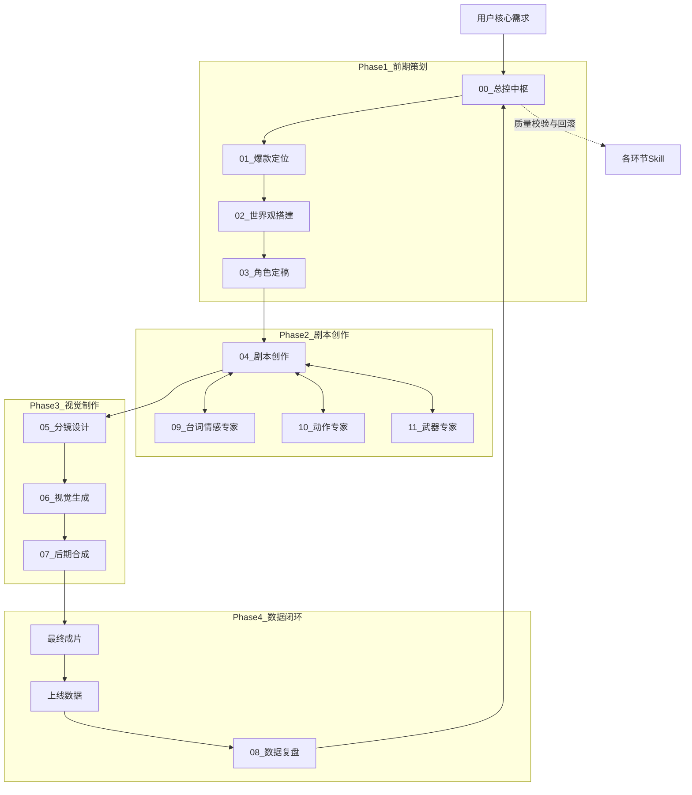

# 漫剧剧本创作 SkillSet 逻辑架构说明

## 1. 总体架构设计

本 SkillSet 是一个**专用于全自动生成高质量漫剧剧本及相关资产**的垂直领域专家系统。其核心架构采用了**“总控中枢 + 线性流程模块 + 垂直领域专家系统”**的复合设计。

*   **总控中枢 (Central Control)**：全流程的大脑，负责任务拆解、流程调度、质量校验和数据流转。
*   **线性流程模块 (Process Modules)**：按照漫剧制作的工业化流程，从定位到复盘，分阶段执行具体任务。
*   **垂直专家系统 (Expert Systems)**：针对台词、动作、武器等高难度、易出错环节，提供深度的专业支持和校验。

---

## 2. 核心模块与功能逻辑

### 2.1 核心控制层
*   **[00_总控中枢_全自动协调器](00_总控中枢_全自动协调器.md)**
    *   **定位**：全流程的调度中心与质量守门人。
    *   **功能**：接收用户核心需求，拆解任务，按顺序触发各子 Skill。在每个环节输出后执行“行业标准校验”，只有通过校验才进入下一环，否则自动回滚优化。
    *   **输入**：漫剧题材、平台、时长等核心参数。
    *   **输出**：执行计划表、校验报告、统一资产库。

### 2.2 线性生产流程 (从0到1)
1.  **[01_爆款定位与IP孵化](01_爆款定位与IP孵化.md)**
    *   **功能**：大数据验证赛道，锁定高热度低竞争方向，产出IP高概念。
    *   **输入**：题材、平台、受众。
    *   **输出**：IP定位报告、3秒钩子、爽点框架。
2.  **[02_世界观全自动搭建](02_世界观全自动搭建.md)**
    *   **功能**：基于IP定位，构建逻辑闭环、服务于冲突的世界观体系。
    *   **输入**：IP定位报告、核心冲突。
    *   **输出**：完整世界观文档、冰山式呈现方案。
3.  **[03_角色定稿与数字资产](03_角色定稿与数字资产.md)**
    *   **功能**：生成与世界观强绑定的角色设定，并构建用于AI生图的固定数字资产（特征向量）。
    *   **输入**：世界观、IP冲突。
    *   **输出**：角色设定集、数字资产包、一致性提示词。
4.  **[04_剧本全自动创作](04_剧本全自动创作.md)**
    *   **功能**：生成符合竖屏爆款节奏的分镜剧本，双主线推进（外部冲突+内部成长）。
    *   **输入**：世界观、角色资产、爽点框架。
    *   **输出**：全剧大纲、分集大纲、标准化分镜剧本。
5.  **[05_分镜与镜头语言设计](05_分镜与镜头语言设计.md)**
    *   **功能**：将剧本转化为AI可执行的影视级分镜指令。
    *   **输入**：分镜剧本、角色资产。
    *   **输出**：分镜脚本、画面提示词、运镜参数。
6.  **[06_视觉生成与一致性优化](06_视觉生成与一致性优化.md)**
    *   **功能**：执行“线稿→强化→渲染”流程，产出电影级画面，确保角色一致性。
    *   **输入**：分镜脚本、角色资产。
    *   **输出**：线稿、渲染图、画面素材包。
7.  **[07_后期音频与成片合成](07_后期音频与成片合成.md)**
    *   **功能**：自动完成配音、剪辑、特效、字幕，输出最终成片。
    *   **输入**：画面素材、分镜脚本、台词。
    *   **输出**：最终成片、字幕文件、音频工程。
8.  **[08_数据复盘与迭代优化](08_数据复盘与迭代优化.md)**
    *   **功能**：基于上线数据（完播、互动），反哺优化下一集内容。
    *   **输入**：上线数据报表。
    *   **输出**：复盘报告、迭代指令。

### 2.3 垂直专家系统 (深度优化)
*   **[09_双专家系统_台词与情感优化](09_双专家系统_台词与情感优化.md)**
    *   **功能**：为角色建立“语言指纹”，优化台词节奏，设计情感锚点，消除AI感。
    *   **介入点**：剧本创作环节。
*   **[10_动作专家系统_武术指导](10_动作专家系统_武术指导.md)**
    *   **功能**：建立“动作指纹”，设计符合物理逻辑和人设的动作戏，匹配竖屏节奏。
    *   **介入点**：剧本创作、分镜设计环节。
*   **[11_武器专家系统_道具设计](11_武器专家系统_道具设计.md)**
    *   **功能**：建立“武器身份卡”，确保道具参数专业、使用逻辑合理，与动作/剧情联动。
    *   **介入点**：角色定稿、剧本创作、分镜设计环节。

---

## 3. 运行逻辑图示

## 4. 总结

该 SkillSet 构建了一个**高度工业化、自动化、专业化**的漫剧生产流水线。
*   **工业化**：通过标准化的输入输出和严格的校验标准，保证产出质量的稳定性。
*   **自动化**：总控中枢实现了流程的自动流转，减少了人工干预成本。
*   **专业化**：引入台词、动作、武器等垂直专家系统，解决了通用大模型在特定领域不够专业的问题。
